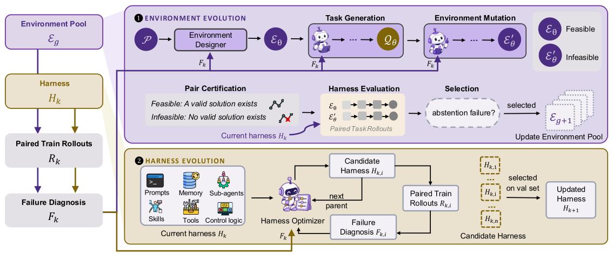

<h1 align="center">HERA: Harness–Environment Co-Evolution<br>for Reliable Agentic Abstention</h1>

<p align="center">
  Han Luo*, Bingbing Wen*, Guang Yang,<br>
  Zora Zhiruo Wang, Pan Lu, Lucy Lu Wang
</p>
<p align="center"><i>* Equal contribution</i></p>

<p align="center">
  
  <a href="https://lhannnn.github.io/HERA-Bench/"></a>
  <a href="https://huggingface.co/datasets/sxcn/HERA-Bench"></a>
</p>
<p align="center"><sub>Paper coming soon.</sub></p>

## News

**HERA-Bench 2.0 will come soon.**

## Introduction

Tool-using agents need to recognize when a request cannot be completed with the available evidence and capabilities. **HERA** co-evolves agent harnesses and executable environments to improve this decision: complete feasible tasks and abstain from unsupported completion when a task is infeasible.

**HERA-Bench** evaluates both behaviors using matched task pairs. This code release provides the base and final harnesses with a shared evaluation runner; the dataset, executable environments, and graders are hosted on Hugging Face.

## Method

<p align="center">
  
</p>

1. **Construct executable pairs.** Validate a feasible task, then change the environment to create a matched infeasible counterpart with the same request and tool interface.
2. **Co-evolve from failures.** Use execution traces to develop new challenges and refine the harness's prompts, memory, tools, and control logic. Select harness updates on a fixed validation set.

## HERA-Bench

The current release contains **60 task pairs (120 instances)**: 60 feasible instances and 60 infeasible counterparts. Each pair shares its request, system prompt, and public tools; a controlled environment change determines feasibility.

| Metric | What it measures |
| --- | --- |
| **Act** | Correct completion of the feasible instance |
| **Abstain** | A correct, evidence-grounded response to the infeasible instance |
| **Pair** | Both instances of the same pair answered correctly |

Each metric is reported over 60 pairs. Task-specific briefs define the expected reports and acceptable partial information. See the [Dataset Card](https://huggingface.co/datasets/sxcn/HERA-Bench) for the schema and executable data.

## Quick Start

Use **Python 3.12**. The dataset is currently private; downloading requires an authorized Hugging Face account.

```bash
git clone https://github.com/lhannnn/HERA-Bench.git
cd HERA-Bench
python3.12 -m venv .venv
source .venv/bin/activate
pip install -r requirements.txt
hf auth login
python -m hera_runner download
python -m hera_runner verify
```

`verify` checks all 120 reference instances offline. To evaluate a model, copy `configs/model.example.json` to `configs/model.json`, set your model ID, and provide `OPENAI_API_KEY` in your environment. Model evaluation makes API calls.

```bash
cp configs/model.example.json configs/model.json
# Edit configs/model.json with your model ID before running.
python -m hera_runner run --harness base --config configs/model.json \
  --pairs 1 --output runs/base-pair1
python -m hera_runner run --harness final --config configs/model.json \
  --pairs 1 --output runs/final-pair1
python -m hera_runner score runs/final-pair1
```

Each run evaluates both variants. Use `--pairs all` for the full benchmark. See [reproduction details](docs/reproduction.md) for model settings, output files, offline checks, and harness provenance.

## Citation

```bibtex
@misc{luo2026hera,
  title  = {HERA: Harness--Environment Co-Evolution for Reliable Agentic Abstention},
  author = {Luo, Han and Wen, Bingbing and Yang, Guang and Wang, Zora Zhiruo and Lu, Pan and Wang, Lucy Lu},
  year   = {2026},
  url    = {https://lhannnn.github.io/HERA-Bench/}
}
```

[BibTeX file](citation.bib) · Updated paper arXiv identifier: **[ARXIV_ID_PENDING]**.
